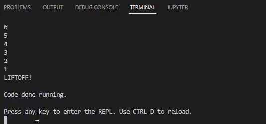
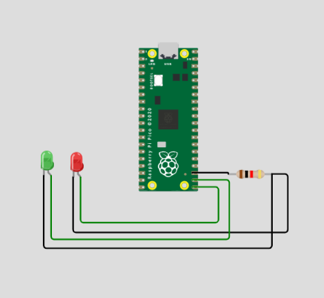
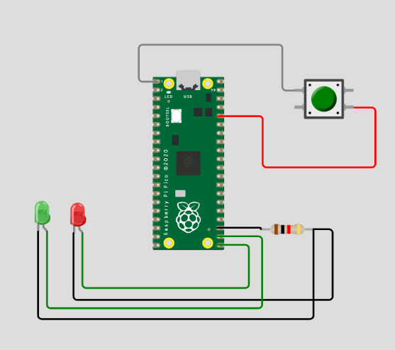
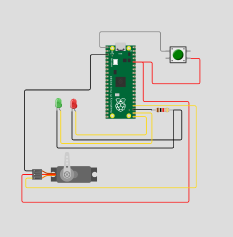

# Engineering_4_Notebook

&nbsp;

## Table of Contents
* [Launchpad Part 1 (countdown)](#Launchpad_1)
* [Launchpad Part 2 (blink)](#Launchpad_2)
* [Launchpad Part 1 (countdown)](#Launchpad_3)
* [Onshape_Assignment_Template](#onshape_assignment_template)

&nbsp;

## Launchpad_1

### Assignment Description

The object of this assignment was to use circuitpython and a Pico to countdown from 10 to 0 (Liftoff) in the console. To do this, we used a for loop to decrement once every second.

### Evidence 

  

### Wiring

Not applicable to this assignment

### Code
[Link to code](https://github.com/GDamiani2927/Engineering_4_Notebook/blob/main/raspberry-pi/launchpad_pt_1.py).
### Reflection

This was a little bit tricky for a couple reasons. The first was that I ran into multiple issues with importing the board, but what I know understand is that we aren't writing in python (which is what I thought), but instead **circuit python**. Once I understood this, the process became a lot clearer. Another problem I ran into was not actually knowing python. Luckily, my best friend google helped me very kindly with this issue.

&nbsp;

## Launchpad_2

### Assignment Description

The object of this assignment was to use circuitpython and a Pico to countdown from 10 to 0 (Liftoff) in the console and blink a red LED every second of the countdown and use a green LED to indicate liftoff.

### Evidence 

  
Video is for next assignment, ignore button.

### Wiring

### Code
[Link to code](https://github.com/GDamiani2927/Engineering_4_Notebook/blob/main/raspberry-pi/launchpad_pt_2.py).
### Reflection

This assignment was fairly straight forward, but it was interesting to start to use wiring that I'm used to on a board that I'm not used to. Figuring ut how to make the code make the light blink, and not just turn on, took a little bit of thought. My eventual solution was to make it turn of at the beginning of the for loop and then turn off 0.2 seconds in to give a sort of blinking effect.

&nbsp;

## Launchpad_3

### Assignment Description

The object of this assignment was to use circuitpython and a Pico to countdown from 10 to 0 (Liftoff) in the console once a button is pressed and blink a red LED every second of the countdown and use a green LED to indicate liftoff. As a spicy extension, i made a buttton to abort the program and end the countdown.

### Evidence 

  

### Wiring

  

### Code
[Link to code](https://github.com/GDamiani2927/Engineering_4_Notebook/blob/main/raspberry-pi/launchpad_pt_3.py).
### Reflection

The bulk of this assignment was quite simple, but the difficulty came when adding the spicy Abort button. The hard part about this is that I formally used the time.sleep() function to pause the program to delay a total of one second. With the new program, this has to be fixed because it cannot check for whether or not the button was pressed because the entire program sleeps. Instead, I used a while loop and checked for whether or not the current time had passed a certain time delay, that way I can leave the loop and subsuquently leave the countdown to abort the mission.

## Launchpad_4

### Assignment Description

The object of this assignment was to use circuitpython and a Pico to countdown from 10 to 0 (Liftoff) in the console once a button is pressed and blink a red LED every second of the countdown and use a green LED to indicate liftoff. At liftoff, we sweep a servo 180 degrees to simulate the detachment of a tower. As a spicty assignment, we slowly sweep the servo from 180 to 0 over the last three seconds.

### Evidence 

  

### Wiring

  

### Code
[Link to code](https://github.com/GDamiani2927/Engineering_4_Notebook/blob/main/raspberry-pi/launchpad_pt_4).
### Reflection

Once again, the main part of this assignment was not overly complicated, with the main complexity coming from the challenge of importing our own package. However, the spicty version of this assignment took considerably more thought. The way I did it was so sweep the servo with a for loop that slowly decrements the angle occurring during each "sleep" loop to decrement by a total of 180 degrees over the full time. I encountered an odd issue with decrementing in which the for loop would be hit way too many times, driving the angle to an impossible negative value. To counterract this problem, I added a variable to check whether or not the loop had already been hit. Although not a perfect solution, it worked for what I needed.
&nbsp;
## Onshape_Assignment_Template

### Assignment Description

Write your assignment description here. What is the purpose of this assignment? It should be at least a few sentences.

### Part Link 

[Create a link to your Onshape document](https://cvilleschools.onshape.com/documents/003e413cee57f7ccccaa15c2/w/ea71050bb283bf3bf088c96c/e/c85ae532263d3b551e1795d0?renderMode=0&uiState=62d9b9d7883c4f335ec42021). Don't forget to turn on link sharing in your Onshape document so that others can see it. 

### Part Image

Take a nice screenshot of your Onshape document. 

### Reflection

What went wrong / was challenging, how'd you figure it out, and what did you learn from that experience? Your goal for the reflection is to pass on knowledge that will make this assignment better or easier for the next person. Think about your audience for this one, which may be "future you" (when you realize you need some of this code in three months), me, or your college admission committee!

&nbsp;

## Media Test

Your readme will have various images and gifs on it. Upload a test image and test gif to make sure you've got the process figured out. Pick whatever image and gif you want!

### Test Link
[test.py](raspberry-pi/test.py)
### Test Image
  
### Test GIF
  
