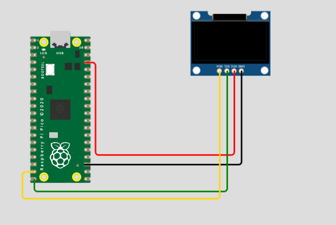

# Engineering_4_Notebook

&nbsp;

## Table of Contents
* [Launchpad Part 1](#Launchpad_1)
* [Launchpad Part 2](#Launchpad_2)
* [Launchpad Part 3](#Launchpad_3)
* [Launchpad Part 4](#Launchpad_4)
* [Crash Avoidance Part 1](#Accelerometer)
* [Crash Avoidance Part 2](#Light-And-Power)
* [Crash Avoidance Part 3](#OLED_Screen)
* [Beam Part 1](#Beam_1)   
* [Beam Part 3](#Beam_3)
* [Beam Part 4](#Beam_4)
* [Landing Area Part 1](#Landing_Area_Pt_1)
* [Landing Area Part 2](#Landing_Area_Pt_2)

&nbsp;

## Launchpad_1

### Assignment Description

The object of this assignment was to use circuitpython and a Pico to countdown from 10 to 0 (Liftoff) in the console. To do this, we used a for loop to decrement once every second.

### Evidence 

  

### Wiring

Not applicable to this assignment

### Code
[Link to code](https://github.com/GDamiani2927/Engineering_4_Notebook/blob/main/raspberry-pi/launchpad_pt_1.py).
### Reflection

This was a little bit tricky for a couple reasons. The first was that I ran into multiple issues with importing the board, but what I know understand is that we aren't writing in python (which is what I thought), but instead **circuit python**. Once I understood this, the process became a lot clearer. Another problem I ran into was not actually knowing python. Luckily, my best friend google helped me very kindly with this issue.

&nbsp;

## Launchpad_2

### Assignment Description

The object of this assignment was to use circuitpython and a Pico to countdown from 10 to 0 (Liftoff) in the console and blink a red LED every second of the countdown and use a green LED to indicate liftoff.

### Evidence 

  
Video is for next assignment, ignore button.

### Wiring

### Code
[Link to code](https://github.com/GDamiani2927/Engineering_4_Notebook/blob/main/raspberry-pi/launchpad_pt_2.py).
### Reflection

This assignment was fairly straight forward, but it was interesting to start to use wiring that I'm used to on a board that I'm not used to. Figuring ut how to make the code make the light blink, and not just turn on, took a little bit of thought. My eventual solution was to make it turn of at the beginning of the for loop and then turn off 0.2 seconds in to give a sort of blinking effect.

&nbsp;

## Launchpad_3

### Assignment Description

The object of this assignment was to use circuitpython and a Pico to countdown from 10 to 0 (Liftoff) in the console once a button is pressed and blink a red LED every second of the countdown and use a green LED to indicate liftoff. As a spicy extension, i made a buttton to abort the program and end the countdown.

### Evidence 

  

### Wiring

  

### Code
[Link to code](https://github.com/GDamiani2927/Engineering_4_Notebook/blob/main/raspberry-pi/launchpad_pt_3.py).
### Reflection

The bulk of this assignment was quite simple, but the difficulty came when adding the spicy Abort button. The hard part about this is that I formally used the time.sleep() function to pause the program to delay a total of one second. With the new program, this has to be fixed because it cannot check for whether or not the button was pressed because the entire program sleeps. Instead, I used a while loop and checked for whether or not the current time had passed a certain time delay, that way I can leave the loop and subsuquently leave the countdown to abort the mission.

## Launchpad_4

### Assignment Description

The object of this assignment was to use circuitpython and a Pico to countdown from 10 to 0 (Liftoff) in the console once a button is pressed and blink a red LED every second of the countdown and use a green LED to indicate liftoff. At liftoff, we sweep a servo 180 degrees to simulate the detachment of a tower. As a spicty assignment, we slowly sweep the servo from 180 to 0 over the last three seconds.

### Evidence 

  

### Wiring

  

### Code
[Link to code](https://github.com/GDamiani2927/Engineering_4_Notebook/blob/main/raspberry-pi/launchpad_pt_4).
### Reflection

Once again, the main part of this assignment was not overly complicated, with the main complexity coming from the challenge of importing our own package. However, the spicty version of this assignment took considerably more thought. The way I did it was so sweep the servo with a for loop that slowly decrements the angle occurring during each "sleep" loop to decrement by a total of 180 degrees over the full time. I encountered an odd issue with decrementing in which the for loop would be hit way too many times, driving the angle to an impossible negative value. To counterract this problem, I added a variable to check whether or not the loop had already been hit. Although not a perfect solution, it worked for what I needed.
&nbsp;

## Accelerometer

### Assignment Description

The object of this assignment was to use circuitpython, a Pico, and an accelerometer (MPU), to constantly update and display values for X, Y, and Z acceleration.

### Evidence 

  

### Wiring

  

### Code
[Link to code](https://github.com/GDamiani2927/Engineering_4_Notebook/blob/main/raspberry-pi/crash_avoidance_pt_1).
### Reflection

This assignment was the first time that we used an external board (the MPU) in conjunction with our Pico. This was surprisingly easy, but did take a couple times to get right because I forgot that it had to be wired to ground. Once I figured this out, the assignment fell into place, and I had some fun with fStrings to print some more complex strings. Althought I don't believe that this is an issue, it's interesting that the accelerometer doesn't read -10 (or something of the like) when at a netural position, instead displaying around -8. It seems unlikely that the error would be this high given how close it is to 0 in x an y whne not tilted, but this could be because of factory tolerance.

&nbsp;

## Light-And-Power

### Assignment Description

The object of this assignment was to use circuitpython, a Pico powered by an external power source, and an accelerometer (MPU), to constantly update and display values for X, Y, and Z acceleration and turn on an LED when the board is tilted more than a set treshold.

### Evidence 

  

### Wiring

  

### Code
[Link to code](https://github.com/GDamiani2927/Engineering_4_Notebook/blob/main/raspberry-pi/crash_avoidance_pt_1).
### Reflection

This assignment was the first time that we used an external board (the MPU) in conjunction with our Pico. This was surprisingly easy, but did take a couple times to get right because I forgot that it had to be wired to ground. Once I figured this out, the assignment fell into place, and I had some fun with fStrings to print some more complex strings.

&nbsp;
## OLED_Screen

### Assignment Description

The object of this assignment was to use circuitpython, a Pico powered by an external power source, and an accelerometer (MPU), to constantly update and display values for X, Y, and Z acceleration on an OLED screen and turn on an LED when the board is tilted more than a set treshold.

### Evidence 

  

### Wiring

  

### Code
[Link to code](https://github.com/GDamiani2927/Engineering_4_Notebook/blob/main/raspberry-pi/crash_avoidance_pt_3).
### Reflection

This assignment was frusturating at times because of the I2C adressing complexity. Finding the addressing itself was easy, but implementing the code and integrating it with the pre-existing lines was difficult because everything now had depndencies of some sort, meaning the order was crucial. I've had some experience with I2C, but have never dealt with manually adressing them, which was an interesting challenge. Once I understood this, the next hurdle was wiring. This assignment was an exercise in READING THE ASSIGNMENT, as I was stuck for at least 10 minutes because I hadn't wired the RST to any pin.

&nbsp;
## Beam_1

### Assignment Description

The purpose of this assignment was to create a beam that can withstand enough weight and no flex or break. There were numerous requirements for this, including but not limited to a length to the hole of 180mm, less than 13 grams in total, and no overhangs.

### Part Link 

[Link to document](https://cvilleschools.onshape.com/documents/c407a01931b8eba03dec4159/w/43c6c11648628f76d52336ae/e/85621042ae551a6f13bf6ea8). 

### Part Image

 
.png)  

### Reflection

There were a lot of tricky constraints that made this assignment difficult. The hardest constraint was that we couldn't have an overhang of 45 degrees or more acute. Our first idea was a honeycomb structure but after we saw this constraint, we had to change our design. We tried to use circles but that also got vetoed because of the overhang. In the end, we used triangles which have good structural integrity and no overhangs. We didn't run into any problems with the weight of 13 grams unlike other teams did. We feel like we needed a better system to have both of us working on the document at the same time. Maybe it would have been better if we were side by side instead of across from each other.

&nbsp;

## Beam_3

### Assignment Description

The objective of this assignment was to simulate what would happen to our beam under 30N of pressure in an onshape simulation.

### Part Link

[Link to document](https://cvilleschools.onshape.com/documents/c407a01931b8eba03dec4159/w/43c6c11648628f76d52336ae/e/5e86bb4a23adabcf187f2e56).

### Part Image

 

### Reflection

This assignment was straightforward but you could lose a lot of precious time if you clicked on the wrong thing. Before you run the simulation you need to make sure you have a face selected and not a point. If you select a point, your results will be too good to be true. Another thing is being aware of what you're doing when the simulation is running. The simulation takes an insane amount of time but if you click on another tab in onshape, it will reset the entire process. Make sure to set a good amount of time aside to render the effects of weight on your design.

&nbsp;

## Beam_4

### Assignment Description

The purpose of this assignment was to improve our beam based on the results found from FEA (finite element analysis) so as to make it hold more weight than it did in previous simulations. The constraints of this were the same as they were in previous assignments, meaning that all changes had to comply to all of the same rules.

### Part Link 

[Link to document](https://cvilleschools.onshape.com/documents/c407a01931b8eba03dec4159/w/43c6c11648628f76d52336ae/e/85621042ae551a6f13bf6ea8). 

### Part Image

 
  

### Reflection

This assignment was the most time consuming yet, as trying to improve the structural integrity of the beam resulted in a massive increase in weight, surpassing the 13g restriction. To fit this constraint, I had to cut multiple holes which, in turn, decreased the integrity of the beam. This cycle of shortcomings continued again and again, until we realized that the biggest fault was right in the middle of the beam. Our solution was to slap on material from other parts of the build onto the middle, thickening the weakest points on the beam, resulting in a dramatic drop in displacement from roughly 85 all the way down to 16 millimeters at 30 N of force.

&nbsp;

## Landing_Area_Pt_1

### Assignment Description

The object of this assignment was to use python to calculate the area of a triangle given three points on a cartesian coordinate planes. This had to be completed through the use of functions and, as an added level, it has to be able to detect if the user inputs bad data not in the x,y format.

### Evidence 

  

### Wiring

No wiring diagram needed for this assignment

### Code
[Link to code](https://github.com/GDamiani2927/Engineering_4_Notebook/blob/main/raspberry-pi/landing_area_pt_1).
### Reflection

This assignment was a good refreseher on how to use functioins in python, as it had been about five years since I had last done so when I was first learning how to code. I found the structure much more agreeable than that of Java or C++, as it flows much better visually, more like english. The meat and potatoes of this assignment was the input from the user and handling it to confirm it is in the right format. To achieve this, I ended up doing a completely seperate function just to take the input and process it. This allowed me to receive user input and process it in only three lines, calling the function once for each point and them putting those processed points into the simple function to output area.

&nbsp;

## Landing_Area_Pt_2

### Assignment Description

The object of this assignment was to use python to calculate the area of a triangle given three points and then plot them on and OLED screen, connecting them with a triangle. The program must then ask for the next set of coordinates and repeat the cycle.

### Evidence 

  

### Wiring

### Code
[Link to code](https://github.com/GDamiani2927/Engineering_4_Notebook/blob/main/raspberry-pi/landing_area_pt_2).
### Reflection

This assignment was surprisingly difficult, given that we had already worked with OLED screens. My first issue with it was the coordinate shift, as the OLED and input use a different plane shift, so adjusting for that is crucial. In hindsight I should have just taken the time to write it down and visualize it instead of spending half an hour trying and failing to guess it correctly, but my function did work out in the end. The other issue I ran into was with wiring, as for 20 minutes I had SCL and SDA switched, yet was only looking at issues in my code. This resulted in my OLED showing static for the entire time, but I was able to switch the wiring based on previous documentation.

&nbsp;

## Morse_Code_1

### Assignment Description

The object of this assignment was to use python to take a user inputted string and then output the string converted into morse code. 

### Evidence 

  

### Wiring

No wiring diagram needed for this assignment

### Code
[Link to code](https://github.com/GDamiani2927/Engineering_4_Notebook/blob/main/raspberry-pi/landing_area_pt_2).
### Reflection
When I originally did this assignment, my goal was to complete this assingment in as few lines of code as possible, as it seemed easy enough that I could do it without much difficulty. However, I quickly realized that i was sacrificing readibility for brevity, in other words the code was unintelligible. To remedy this, I made the decision to increase the length of my code and so too the clearness of the program. This was a valuable lesson, therefore, in the importance of readable code, as although it is slightly longer the code does the assignment just as well and can now be understood by all 

&nbsp;
